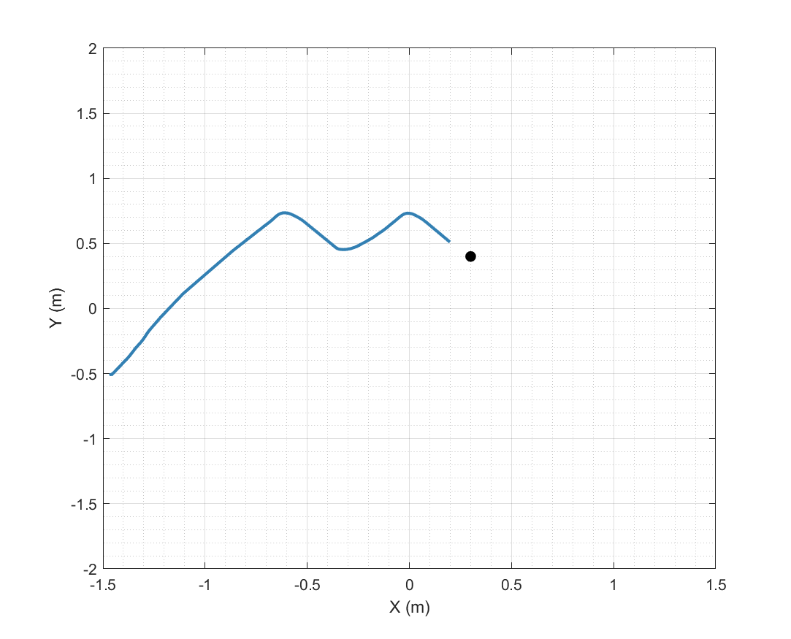

**Ant Colony Optimization**

Este algoritmo está basado en el comportamiento natural de una colonia de hormigas, donde se observa como las hormigas tienen la capacidad de encontrar un camino óptimo entre el hormiguero y una fuente de alimento. A partir de este comportamiento, Marco Dorigo desarrolló un algoritmo denominadoAnt System(SA), que luego de basarse en un método metaheurístico, en donde se ven a las hormigas como base del algoritmo ACO, que permite la solución de problemas discretos de optimización.

**Descripción de Funciones**

* *robotat_connect.m*

Esta función en MATLAB establece una conexión con un robot 3Pi, identificado por un número de agente único. Verifica la validez del ID del agente, determina la dirección IP en función del rango del ID y crea un cliente TCP para establecer la conexión.

* *robotat_get_pose.m*

Esta función en MATLAB obtiene datos de posición (pose) de robots 3Pi a través de una conexión TCP. Envía una solicitud al servidor con los IDs de los agentes, espera la respuesta y decodifica los datos JSON recibidos. Puede manejar representaciones de rotación en cuaterniones o ángulos de Euler, convirtiendo automáticamente si es necesario.

* *robotat_disconnect.m*

Esta función en MATLAB realiza la desconexión del cliente TCP con el servidor Robotat. Envía la señal 'EXIT' al servidor, imprime un mensaje de desconexión y limpia la variable de entrada en el espacio de trabajo de MATLAB.

* *robotat_3pi_connect.m*

Esta función en MATLAB establece una conexión con un robot 3Pi, identificado por un número de agente único. Verifica la validez del ID del agente, determina la dirección IP en función del rango del ID y crea un cliente TCP para establecer la conexión. Además, ahora incluye una verificación adicional para asegurar la validez y apertura de la conexión TCP.

* *robotat_3pi_set_wheels_velocities.m*

Esta función en MATLAB establece las velocidades de las ruedas izquierda y derecha de un robot 3Pi, asegurándose de que estén dentro de los límites permitidos. Utiliza un formato de codificación CBOR para enviar las velocidades al robot a través de la conexión TCP establecida. Adicionalmente, emite advertencias si las velocidades exceden los límites especificados.

* *robotat_3pi_force_stop.m*

Esta función en MATLAB detiene forzosamente las ruedas izquierda y derecha de un robot 3Pi, estableciendo las velocidades a cero. Utiliza el formato de codificación CBOR para enviar las velocidades al robot a través de la conexión TCP establecida.

* *robotat_3pi_disconnect.m*

Esta función en MATLAB realiza la desconexión del robot 3Pi, eliminando la variable asociada en el espacio de trabajo de MATLAB y mostrando un mensaje de desconexión.

  

